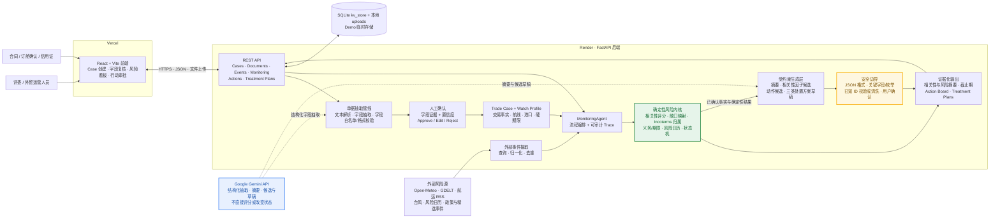

# ForeSail 技术架构图

## 架构边界

- `MonitoringAgent` 只负责编排流程与记录 Trace；相关性评分、风险分类、敞口映射、Incoterms 责任归属、合同/信用证硬期限处理和状态流转均由确定性服务完成。
- Gemini 负责单据字段抽取、运行摘要、相关性因子候选、动作候选和处置方案草稿；结构化候选要求返回 JSON 对象，并经过关键字段、枚举、日期格式和已知 ID 的代码校验或清洗。动作候选可以包含建议执行日期，处置方案可以包含估算成本，但不会改写已确认交易金额、合同期限或核心风险决策；结果仍须用户确认。
- 当前免费 Demo 使用 SQLite 与本地上传目录。Render 文件系统可能在休眠或重部署后清空，因此该存储仅适用于演示环境。

## 代码证据映射

| 架构模块 | 可核验代码位置 |
|---|---|
| React/Vite 前端与 API 调用 | `frontend/src/App.tsx`、`frontend/src/pages/CaseWorkspace.tsx`、`frontend/src/api/client.ts` |
| FastAPI API 层 | `backend/app/main.py`、`backend/app/api/` |
| 单据抽取与字段确认 | `backend/app/services/document_service.py`、`document_extraction_pipeline.py`、`extraction_schema_validator.py` |
| 外部事件摄取 | `backend/app/services/event_ingestion_service.py`、`backend/app/services/event_connectors/` |
| Agent 编排 | `backend/app/agents/monitoring_agent.py` |
| 确定性风险内核 | `backend/app/services/relevance_engine.py`、`risk_mapper.py`、`incoterm_rule_service.py`、`obligation_service.py`、`status_machine.py` |
| Gemini 与受约束生成 | `backend/app/services/llm_provider.py`、`structured_llm_service.py`、`agent_summary_service.py`、`action_set_service.py`、`treatment_plan_service.py` |
| 持久化与上传文件 | `backend/app/services/persistence_service.py`、`backend/app/services/document_service.py` |
